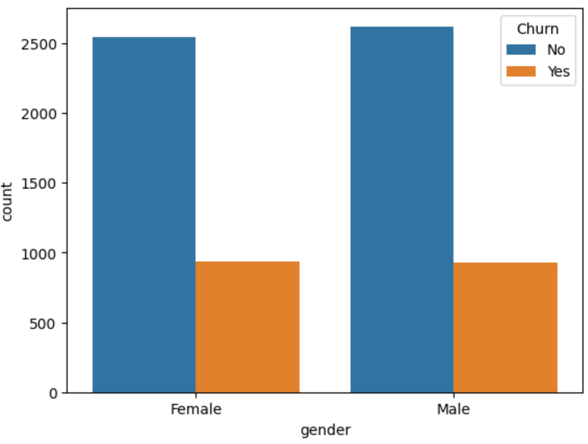
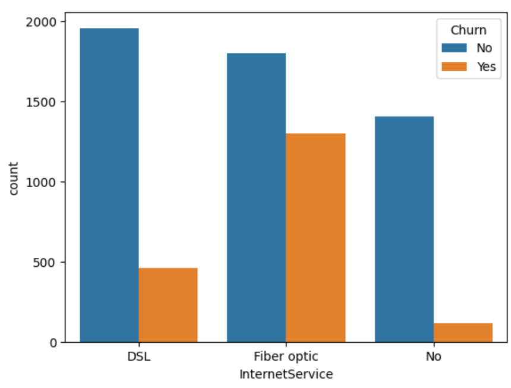
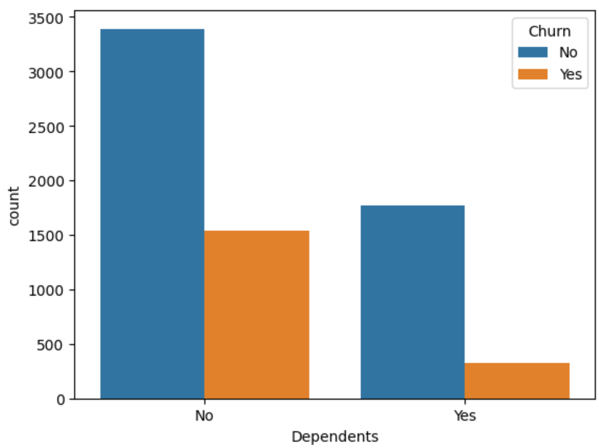
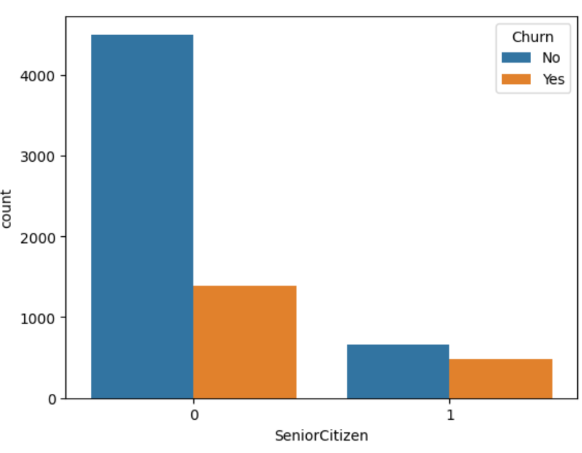

# 🔮 [Customer Churn Prediction & Analysis Dashboard](https://customer-churn-predictiongit-97cqvdlvyfanfvmfpq4y7z.streamlit.app/)  

  
  
  
  

---

## 📌 Project Overview  
Customer churn is one of the most critical challenges in subscription-based businesses. This project provides an **interactive Streamlit dashboard** that enables:  

✅ **Customer Churn Prediction** – Predict whether a customer will churn or continue.  
✅ **Churn Analysis** – Explore insightful visualizations on customer demographics, services, and contracts.  

The app is powered by a **pre-trained Random Forest model** (with SMOTEENN balancing), and offers an **easy-to-use interface** for both business users and analysts.  

---

## 🛠️ Tech Stack  

- **Programming Language**: Python 🐍  
- **Libraries**:  
  - Data Handling: `pandas`, `numpy`  
  - Visualization: `matplotlib`, `seaborn`  
  - ML Models: `scikit-learn`, `imblearn (SMOTEENN)`  
  - App Framework: `streamlit`  
- **Model**: Random Forest Classifier  

---

---

## 🚀 Features  

### 1️⃣ Churn Prediction Module  
- Input **customer details** (both numeric & categorical).  
- Encodes categorical features automatically.  
- Uses trained ML model for prediction.  
- Displays **prediction with confidence percentage**:  
  - 🔴 *High chance of churn*  
  - 🟢 *Likely to continue*  

### 2️⃣ Churn Analysis Dashboard  
- Select from multiple **visualizations**:  
  - Dependents distribution  
  - Senior Citizen vs Churn  
  - Fiber Optic usage impact  
  - Gender-based churn trends  
  - Multiple services analysis  
  - Security/Tech Support insights  
- Interactive **dropdown-based navigation**.  

---

## 📊 Example Visualizations  

| Churn by Gender | Churn by Internet Service |  
|-----------------|---------------------------|  
|  |  |  

---

## 📝 Analysis Report  

The **churn analysis module** provides valuable insights into customer behavior. Below is a summary of the findings:  

### 📌 Key Insights  
- **Dependents**: Customers without dependents are more likely to churn.  
- **Senior Citizens**: Higher churn rate compared to younger customers.  
- **Internet Service**: Fiber optic users show significantly higher churn rates.  
- **Gender**: Churn rate is almost equally distributed across genders.  
- **Multiple Lines**: Customers with multiple lines churn slightly more often.  
- **Online Security & Tech Support**: Customers **without security or support services** have a higher probability of leaving.  
- **Contract Type**: Month-to-month contracts have the **highest churn**, while 2-year contracts show much lower churn.  
- **Payment Method**: Customers paying via **electronic check** churn more frequently.  

---

## 📸 Screenshots  

### 🔮 Prediction Page  
  

### 📈 Example Graphs  
| Dependents vs Churn | Senior Citizens vs Churn |  
|---------------------|---------------------------|  
|  |  |  

---

## ⚙️ Installation & Setup  

### 1️⃣ Clone the repository  
```bash
git clone https://github.com/your-username/customer-churn-app.git
cd customer-churn-app


